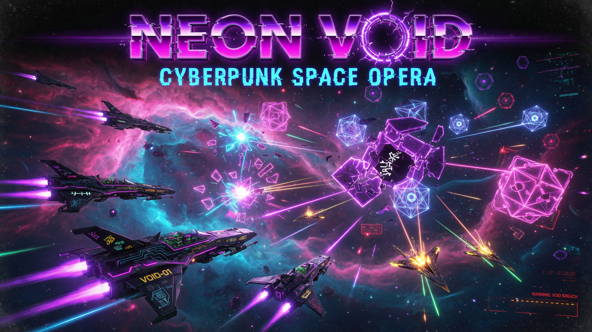

# NEON VOID | Galactic Survival v2.0




**NEON VOID v2.0** is a high-octane, rogue-lite space survival game. Navigate through a neon-infused void, fight off waves of galactic entities, salvage data scraps, and upgrade your ship to become the ultimate survivor.

## How to Play

| Action | Desktop | Mobile |
| :--- | :--- | :--- |
| **Move** | WASD / Arrow Keys | Virtual Joystick |
| **Aim** | Mouse Cursor | Automatic |
| **Dash** | Space / Shift | DASH Button |
| **Chronos Field** | E | TIME Button |
| **Void Pulse** | Q | - |
| **Pause** | Esc | II Button |

Survive as many waves as possible. Collect XP to level up and salvage data scraps upon death to buy permanent upgrades in the hangar.

## Installation

1. Clone the repository:
   ```bash
   git clone https://github.com/LIN4CRE/NeonVoid.git
   ```
2. Open `index.html` in any modern web browser.

## License

MIT License
